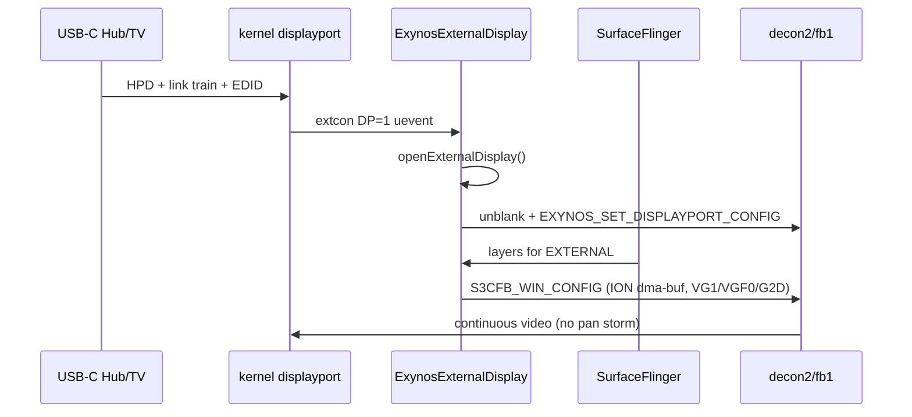

# الگوی DeX / HDMI سامسونگ — راهنمای ادامه کار (star2lte / Exynos9810)

هدف: به‌جای مسیر hackی `screencap → fb1 pan`، از همان مسیر **تأیید‌شدهٔ سامسونگ** الگو بگیریم که روی استوک کار می‌کند.

## جمع‌بندی یک‌خطی

| لایه | استوک DeX / Mirror | کاری که ما می‌کردیم | نتیجه |
|------|---------------------|---------------------|--------|
| لینک DP | `displayport` + training + EDID | همین | OK (BIST قرمز) |
| خروجی فریم | **HWC ExternalDisplay** → `S3CFB_WIN_CONFIG` روی `fb1`/`decon2` با بافر ION + fence | `FBIOPAN_DISPLAY` / colormap / mirror | DMA starve / FIFO under |
| UI دسکتاپ | `SemDesktopModeManager` (framework سامسونگ) | نداریم روی PE | اختیاری؛ اول باید HWC زنده شود |

**نتیجه:** مشکل UI الان «کرنل لینک» نیست؛ «مسیر تغذیهٔ فریم مثل HWC/DeX» است. DeX کامل لازم نیست — همان **Mirror استوک** هم از HWC External می‌آید.

---

## معماری استوک (ساده‌شده)



نکات مهم از HWC عمومی Lineage/SLSI برای `exynos9810`:

- External node: `/dev/graphics/fb1`
- Vsync: `16050000.decon_t/vsync`
- Hotplug: `11090000.displayport` + `extcon0`
- DPPهای مجاز برای EXTERNAL در جدول HWC: عمدتاً **VG1** و **VGFS0 (VGF0)** (+ G2D برای RGB/YUV)
- هر فریم با **WIN_CONFIG** می‌آید، نه با تکرار `FBIOPAN_DISPLAY`

منبع لوکال کلون‌شده:

`reference/android_hardware_samsung_slsi-linaro_graphics/base/libhwc2.1/platform/exynos9810/`

---

## چرا مسیر mirror ما می‌ترکد؟

1. `decon_pan_display` یک‌بار DPP را arm می‌کند؛ استوک هر vsync با WIN_CONFIG + fence تغذیه می‌کند.
2. HWC برای EXTERNAL از **VG1 / VGF0** و غالباً **G2D** استفاده می‌کند؛ colormap/winmap برای تست لینک عالی است ولی UI نیست.
3. روی PE، `openExternalDisplay()` عملاً OWNER نمی‌شود → کرنل بعد از timeout به BIST می‌رود (رفتار درست).

---

## فایل‌های مرجع دانلود‌شده در این ریپو

| مسیر | چیست |
|------|------|
| `reference/android_hardware_samsung_slsi-linaro_graphics/` | HWC2.1 SLSI — پلتفرم `exynos9810` + ExternalDisplay |
| `reference/device_samsung_exynos9810-common/` | device tree PE (composer@2.4، allocator، …) |

### دانلود اختیاری از Samsung Open Source (دستی)

1. برو به: https://opensource.samsung.com/main  
2. مدل: **SM-G965F** (همان PDA که روی گوشی است، مثلاً `G965FXXUHFVG6`)  
3. پکیج **Kernel** را بگیر — همان `dpu_9810/displayport_*.c` و `decon_*.c` استوک برای diff با درخت ما.  
4. داخل `reference/samsung-oss-G965F…/` از حالت بگذار (عمداً در gitignore بماند اگر حجیم بود).

Framework DeX (`SemDesktopModeManagerService`) **اوپن‌سورس کامل نیست**؛ فقط از Knox/SDK و رفتار استوک الگو می‌گیریم. برای PE هدف اول **Mirror از طریق HWC** است نه کل UI دسکتاپ DeX.

---

## نقشهٔ کار پیشنهادی (به‌ترتیب اولویت)

### فاز A — HWC External مثل استوک (بالاترین ROI)
1. با هاب وصل:  
   `logcat -b all | grep -iE 'ExternalDisplay|openExternalDisplay|HPD|displayport|HwComposer'`
2. ببین `handleHotplugEvent(true)` و `openExternalDisplay()` صدا زده می‌شود یا fail.  
3. علت‌های محتمل روی PE:
   - uevent path / `DP_LINK_NAME` mismatch
   - SELinux روی `fb1` / sysfs DP
   - timeout کرنل قبل از اینکه HWC `DISPLAYPORT_STATE_ON` کند
   - `dex`/`dp_drm` sysfs مزاحم
4. وقتی `dumpsys display` یک display خارجی نشان داد → UI واقعی بدون mirror ما.

### فاز B — کرنل فقط برای HOST کردن HWC
- HPD: BIST کوتاه یا wait کافی برای HWC (نه auto-kick DMA).  
- `default_idma` برای decon2: **VG1** (هم‌راستا با جدول HWC).  
- رزرو win/IDMA طوری که primary تلفن سیاه نشود.  
- مسیر `S3CFB_WIN_CONFIG` را دست نزن مگر باگ ثابت شود.

### فاز C — DeX UI (اختیاری، دیرتر)
- فقط بعد از فاز A.  
- نیاز به سرویس‌های سامسونگ / پورت سنگین؛ برای «تصویر واقعی روی TV» لازم نیست.

### فاز D — hdmi_mirror
- فقط fallback اگر HWC ممکن نشد.  
- الگو از DeX: یا WIN_CONFIG userspace، یا رها کردن pan.

---

## چک‌لیست تست وقتی فاز A جلو رفت

```bash
# hub plugged
cat /sys/class/extcon/extcon0/state   # DP=1
dumpsys display | grep -i external
logcat -d | grep -i openExternalDisplay | tail
# expect: phone UI mirrored (or DeX-like) without bist bars
```

اگر HWC باز شد ولی سیاه بود → آن وقت فقط کرنل WIN_CONFIG/BTS را با استوک OSS diff کن.

---

## هم‌راستاسازی با وضعیت فعلی پروژه

| مورد | وضعیت |
|------|--------|
| BIST / لینک Sony | اثبات‌شده |
| Live winmap قرمز | اثبات‌شده روی `#35` |
| DMA pan / mirror | شکست‌خورده — با الگوی DeX کنار بگذار |
| گام بعدی دفتر | فاز A — [`HWC_PHASE_A.md`](HWC_PHASE_A.md) + logcat HWC |
| کرنل host | `hpd_wait_ms=12s` + `displayport_hwc_takeover` روی WIN_CONFIG |

منابع رسمی/عمومی استفاده‌شده:
- LineageOS `android_hardware_samsung_slsi-linaro_graphics` (exynos9810 ExternalDisplay)
- PixelExperience `device_samsung_exynos9810-common`
- Samsung Developer / Knox docs (رفتار DesktopMode، نه سورس کامل)
- Samsung Open Source portal برای kernel SM-G965F
